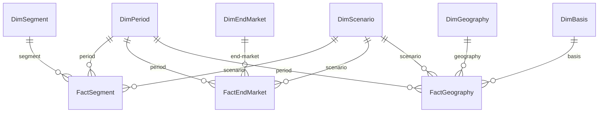

# NVIDIA Segment FP&A Model

A reconciled, query-able star-schema data layer over NVIDIA's FY24–FY26 segment, end-market, and geography disclosures, with a Python ETL pipeline, a SQL-based validation suite that proves every disaggregation ties to the consolidated income statement to the dollar, and an analytical SQL layer demonstrating window-function patterns over the reconciled data.

**Status:** Weeks 1–2 of 4 complete. Week 1 (data foundation) and Week 2 (SQL analysis layer) shipped. Week 3 (3-statement model + DCF) and Week 4 (Power BI dashboard + executive memo) to follow.

---

## Headline findings

- **NVIDIA FY26 total revenue: $215.9B**, up 65% YoY from FY25's $130.5B and up 254% in two years from FY24's $60.9B.
- **Q4 FY26 was a record quarter** — $68.1B in revenue with 65.0% operating margin, the largest quarter NVIDIA has ever reported.
- **Data Center is now ~90% of total revenue**: $193.7B in FY26 vs $47.5B in FY24 — 4× in two fiscal years.
- **Within Data Center, Networking is growing fastest** — 161.8% YoY in Q3 FY26 ($3.1B → $8.2B), accelerating to 263% YoY in Q4. The AI cluster build-out is showing up in fabric and interconnect, not just compute silicon.
- **China inflected from peak to decline in one year** — China revenue grew +103% in FY25 (to $25.0B) and then fell −21% in FY26 (to $19.7B). China's share of total revenue more than halved from 20.2% to 9.1% across two years, with the share decline preceding the dollar decline. US export controls are the operative driver.
- **Compute & Networking operating margin took a one-quarter hit in FY26Q1** — margin cratered to 55.7% from 69% prior quarter, then snapped back to 68.6% the next quarter. Almost certainly the H20 inventory and purchase-commitment write-down (~$5–6B implied) triggered by the April 2025 export-control update. The underlying margin profile held at ~70% throughout — a balance-sheet event, not a P&L trend.
- **Corporate unallocated cost grew 37% YoY**, from −$6.5B to −$8.9B. Headline sounds expensive; cost grew at roughly half the rate of revenue (+65%), so cost-as-a-percentage-of-sales actually improved from 5.0% to 4.1% — positive operating leverage on corporate overhead.

---

## What this project is

The first of a four-week FP&A portfolio project on NVIDIA. The end goal is to demonstrate the full chain from public-disclosure ingestion → reconciled fact tables → analytical SQL → financial model → executive-grade dashboard and memo.

Weeks 1 and 2 (this commit) cover the data foundation and the analytical layer: a 9-table SQLite star schema, a Python ETL that reads reconciled extracts from NVIDIA's 10-K and 10-Q disclosures, a SQL validation suite covering 22 reconciliation checks across 11 periods (all of which pass to the dollar), and 8 named, documented analytical SQL queries answering business questions about NVIDIA's segment performance, end-market dynamics, geographic concentration, margin trajectory, and trailing-4-quarter trends.

---

## For the recruiter

**Skills demonstrated in Weeks 1–2:**
- **Data modeling** — star schema with explicit handling of mixed granularity (quarterly + annual in one fact-table set), mid-year disclosure changes (NVIDIA's FY26 switch from bill-to to customer-HQ geographic basis), and corporate cost allocation (the "All Other" carve-out).
- **SQL DDL and ETL** — foreign-key constraints, multi-CTE reconciliation queries, joins across fact and dimension tables, FK-aware deletion order for idempotent loads.
- **SQL analytics** — window functions (`LAG`, `SUM() OVER (PARTITION BY)`, `ROWS BETWEEN n PRECEDING AND CURRENT ROW`), conditional aggregation, and share-of-total patterns applied to real disclosure data.
- **Python** — pandas-based ETL, sqlite3 for parameterized inserts, function-level structure with validation as a callable step.
- **Financial analysis** — segment operating-income disaggregation, end-market sub-line hierarchy (Data Center → Compute + Networking), geographic concentration and reporting-basis change, margin trajectory by segment, corporate cost vs revenue scaling.
- **Documentation discipline** — every meaningful design choice captured in [decisions.md](decisions.md), every reconciliation visible in the ETL output, every analytical finding captured in the header of its source query.

**Reading time:** about 5 minutes for this README, 15 minutes for `decisions.md` if you want the full design rationale, 10 minutes to skim the `queries/` folder.

---

## For the technical reviewer

### Schema



Six dimension tables, three fact tables, natural `TEXT` primary keys throughout. Granularity (`Quarter` vs `Annual`) is an attribute of `DimPeriod`, so one set of fact tables holds both quarterly and annual rows without double-counting risk. `DimBasis` is a first-class dimension so the FY26 geographic-basis change is query-able rather than silently overwritten. `DimScenario` is built in from day one with placeholder rows for Bull/Base/Bear scenarios that Week 3 will populate.

### Data scope

| Fact table     | Rows | Coverage |
|----------------|-----:|----------|
| FactSegment    | 30   | 8 quarters × 3 segments + 3 years × 2 segments (annual omits "All Other") |
| FactEndMarket  | 77   | 8 quarters × 7 lines + 3 years × 7 lines (incl. DC sub-lines) |
| FactGeography  | 40   | 6 quarters × 4–5 geos (mixed basis) + 3 years × 4 geos (customer-HQ basis) |

Source filings: NVIDIA's FY26 10-K (filed Feb 25, 2026) and three FY26 10-Q filings (May 28, Aug 27, Nov 19 2025). FY25 Q1–Q3 pulled from prior-year comparative columns in the same 10-Qs. FY25Q4 and FY26Q4 derived by subtraction (Annual − Q1+Q2+Q3) for segment and end-market; geography Q4 intentionally not derived (see Decision 8 below).

### Reconciliation suite

Four SQL queries run automatically after every ETL load. All four use CTE-based patterns that mirror what an analytical SQL interview would test for.

1. **Quarterly segment OpInc rolls up to published consolidated annual OpInc** — FY26 $130,387M ✓, FY25 $81,453M ✓
2. **End-market revenue (top-level lines only) equals segment revenue, every period** — 11 of 11 PASS
3. **DC sub-lines sum to parent DC line, every period** — 11 of 11 PASS
4. **Geography revenue equals segment revenue, every period where geography data exists** — 9 of 9 PASS (FY25Q4 and FY26Q4 quarters absent by methodological design; see Decision 8)

22 reconciliation checks, all PASS, all visible in the ETL output. The script raises `RuntimeError` on any failure, so rerunning after a future schema change either passes cleanly or fails loudly.

### Analytical SQL layer (Week 2)

Eight named, documented analytical SQL queries live in [`queries/`](./queries/). Each file has a header comment with the business question, expected output shape, and the verified findings from running the query against the loaded database. The folder has its own [README](./queries/README.md) indexing the eight files by purpose and SQL pattern.

Window-function patterns demonstrated across the eight queries:

- **Period-over-period comparison** — `LAG(value, n) OVER (PARTITION BY ... ORDER BY ...)` for YoY/QoQ growth
- **Share-of-total** — `SUM(value) OVER (PARTITION BY group)` for mix analysis
- **Conditional aggregation** — `SUM(CASE WHEN ... THEN value ELSE 0 END)` to pivot rows into columns
- **Rolling windows** — `ROWS BETWEEN n PRECEDING AND CURRENT ROW` for trailing-period smoothing

The queries surfaced several findings that aren't visible from headline metrics alone — for example, the one-quarter operating-margin crater in Compute & Networking FY26Q1 (the H20 write-down), the divergence between Compute QoQ (−0.9%) and Networking QoQ (+46.3%) in the same quarter (the cluster-build-out story), and the fact that China's share decline preceded its dollar decline by one fiscal year.

### Design decisions

Ten major design decisions are captured with rationale in [decisions.md](decisions.md). The most analytically interesting:

- **Decision 1** — Handling the mid-year geographic basis change without silent overwriting.
- **Decision 2** — Carving out NVIDIA's "All Other" corporate unallocated cost as its own segment row in quarterly fact data, derived from consolidated OpInc minus segment-only OpInc.
- **Decision 4** — Making `DimBasis` a first-class dimension rather than a row-level flag, so the basis change is query-able.
- **Decision 8** — Intentionally not deriving Q4 geography by subtraction, because mixing two reporting bases within a single year would produce arithmetic artifacts rather than meaningful numbers.

### How to run

```
# 1. Clone or download this repo
# 2. Install dependencies (pandas + openpyxl)
pip install pandas openpyxl

# 3. Run the ETL from the Database folder
cd Database
python load_data.py
```

Expected output: dimension row counts (all OK), fact row counts (all OK), four reconciliation check blocks (all PASS across 22 checks), ending with "All reconciliation checks passed." Total runtime: under 2 seconds.

Safe to re-run on a populated database — the script clears facts before dimensions to respect foreign-key order, then reloads everything from the source Excel.

The loaded `nvidia_fpa.db` can be opened in [DB Browser for SQLite](https://sqlitebrowser.org/) (free) or any SQL client to inspect the schema and run the queries in `queries/`.

### Project structure

```
nvidia-segment-fpa/
├── README.md                       ← this file
├── decisions.md                    ← 10 design decisions with rationale
├── LICENSE
├── .gitignore
├── Database/
│   ├── load_data.py                ← Python ETL with validation suite
│   ├── rebuild_excel_from_db.py    ← recovery utility (rebuilds the source Excel from the DB)
│   └── nvidia_fpa.db               ← SQLite database (loaded, ready to query)
├── queries/
│   ├── README.md                   ← index of the 8 analytical queries
│   ├── 01_yoy_annual_growth.sql
│   ├── 02_qoq_and_yoy_quarterly.sql
│   ├── 03_dc_subline_growth.sql
│   ├── 04_segment_mix_shift.sql
│   ├── 05_china_revenue_trend.sql
│   ├── 06_operating_margin_trend.sql
│   ├── 07_corporate_cost_trajectory.sql
│   └── 08_rolling_4q_revenue.sql
└── Raw data/
    └── nvidia_annual_data.xlsx     ← reconciled extracts from 10-K / 10-Qs
```

---

## Roadmap

- **Week 1 — Data foundation. ✓** 9-table star schema in SQLite, Python ETL with parameterized inserts and FK-aware idempotent loads, 22 SQL reconciliation checks all passing to the dollar.
- **Week 2 — SQL analysis layer. ✓** Eight named analytical SQL queries demonstrating LAG, PARTITION BY, conditional aggregation, and ROWS BETWEEN frame clauses over the reconciled data.
- **Week 3 — 3-statement model + DCF.** Build income statement, cash flow, and balance sheet in Excel from the underlying disclosure data, with DCF valuation and Bull/Base/Bear scenarios feeding `DimScenario`.
- **Week 4 — Power BI dashboard + executive memo.** Star-schema-fed dashboard with CALCULATE-based DAX measures (YoY%, OpInc margin, mix shift), and a one-page CFO-style memo on FY26 results and forward outlook.

---

## About

Built by **Lokendra Sharma** — FP&A analyst based in Jaipur, India, with 18 months of industrial training at Lenovo India supporting management reporting across 30+ countries (Apr 2024 – Sep 2025). CA Finalist, BCA, currently building a finance + data engineering portfolio targeting analyst roles at NVIDIA, Microsoft, Google, BMW, and similar global capability centers.

Contact: [lokendrassharma@gmail.com](mailto:lokendrassharma@gmail.com) · [LinkedIn](https://www.linkedin.com/in/lokendra-sharma28/)
