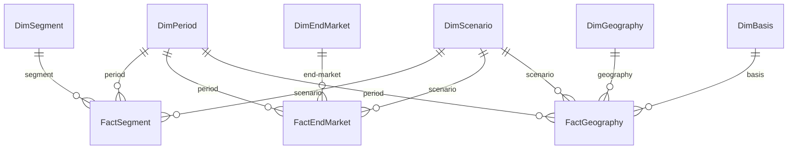

# NVIDIA Segment FP&A Model

A reconciled, query-able star-schema data layer over NVIDIA's FY24–FY26 segment, end-market, and geography disclosures, with a Python ETL pipeline and a SQL-based validation suite that proves every disaggregation ties to the consolidated income statement to the dollar.

**Status:** Week 1 of 4 complete — data foundation shipped. Week 2 (SQL analysis layer), Week 3 (3-statement model + DCF), and Week 4 (Power BI dashboard + executive memo) to follow.

---

## Headline findings

- **NVIDIA FY26 total revenue: $215.9B**, up 65% YoY from FY25's $130.5B and up 254% in two years from FY24's $60.9B.
- **Q4 FY26 was a record quarter** — $68.1B in revenue with 65.0% operating margin, the largest quarter NVIDIA has ever reported.
- **Data Center is now ~90% of total revenue**: $193.7B in FY26 vs $47.5B in FY24 — 4x in two fiscal years.
- **Within Data Center, Networking is growing fastest** — 162% YoY in Q3 FY26 ($3.1B → $8.2B). The AI cluster build-out is showing up in fabric and interconnect, not just compute silicon.
- **China exposure is shrinking** despite explosive overall growth — China revenue fell 21% (FY25 $25.0B → FY26 $19.7B) while total revenue grew 65%. US export controls are the operative driver.
- **Corporate unallocated cost grew 89% YoY**, from –$4.7B to –$8.9B — a real cost of scaling (primarily stock-based compensation) that segment-only operating income hides.

---

## What this project is

The first of a four-week FP&A portfolio project on NVIDIA. The end goal is to demonstrate the full chain from public-disclosure ingestion → reconciled fact tables → analytical SQL → financial model → executive-grade dashboard and memo.

Week 1 (this commit) is the data foundation: a 9-table SQLite star schema, a Python ETL that reads reconciled extracts from NVIDIA's 10-K and 10-Q disclosures, and a SQL validation suite covering 22 reconciliation checks across 11 periods, all of which pass to the dollar.

---

## For the recruiter

**Skills demonstrated in Week 1:**
- **Data modeling** — star schema with explicit handling of mixed granularity (quarterly + annual in one fact-table set), mid-year disclosure changes (NVIDIA's FY26 switch from bill-to to customer-HQ geographic basis), and corporate cost allocation (the "All Other" carve-out).
- **SQL** — DDL with foreign-key constraints, multi-CTE reconciliation queries, joins across fact and dimension tables.
- **Python** — pandas-based ETL, sqlite3 for parameterized inserts, function-level structure with validation as a callable step.
- **Financial analysis** — segment operating-income disaggregation, end-market sub-line hierarchy (Data Center → Compute + Networking), geographic concentration and reporting-basis change.
- **Documentation discipline** — every meaningful design choice captured in [decisions.md](decisions.md), every reconciliation visible in the ETL output.

**Reading time:** about 5 minutes for this README, 15 minutes for `decisions.md` if you want the full design rationale.

---

## For the technical reviewer

### Schema



Six dimension tables, three fact tables, natural `TEXT` primary keys throughout. Granularity (`Quarter` vs `Annual`) is an attribute of `DimPeriod`, so one set of fact tables holds both quarterly and annual rows without double-counting risk. `DimBasis` is a first-class dimension so the FY26 geographic-basis change is query-able rather than silently overwritten. `DimScenario` is built in from day one with placeholder rows for Bull/Base/Bear scenarios that Week 3 will populate.

### Data scope

| Fact table     | Rows | Coverage |
|----------------|-----:|----------|
| FactSegment    | 30   | 8 quarters × 3 segments + 3 years × 2 segments (annual omits "All Other") |
| FactEndMarket  | 77   | 8 quarters × 7 lines + 3 years × 7 lines (incl. DC sub-lines) |
| FactGeography  | 40   | 6 quarters × 4–5 geos (mixed basis) + 3 years × 4 geos (customer-HQ basis) |

Source filings: NVIDIA's FY26 10-K (filed Feb 25, 2026) and three FY26 10-Q filings (May 28, Aug 27, Nov 19 2025). FY25 Q1–Q3 pulled from prior-year comparative columns in the same 10-Qs. FY25Q4 and FY26Q4 derived by subtraction (Annual − Q1+Q2+Q3) for segment and end-market; geography Q4 intentionally not derived (see Decision 8 below).

### Reconciliation suite

Four SQL queries run automatically after every ETL load. All four use CTE-based patterns that mirror what an analytical SQL interview would test for.

1. **Quarterly segment OpInc rolls up to published consolidated annual OpInc** — FY26 $130,387M ✓, FY25 $81,453M ✓
2. **End-market revenue (top-level lines only) equals segment revenue, every period** — 11 of 11 PASS
3. **DC sub-lines sum to parent DC line, every period** — 11 of 11 PASS
4. **Geography revenue equals segment revenue, every period where geography data exists** — 9 of 9 PASS (FY25Q4 and FY26Q4 quarters absent by methodological design; see Decision 8)

22 reconciliation checks, all PASS, all visible in the ETL output. The script raises `RuntimeError` on any failure, so rerunning after a future schema change either passes cleanly or fails loudly.

### Design decisions

Ten major design decisions are captured with rationale in [decisions.md](decisions.md). The most analytically interesting:

- **Decision 1** — Handling the mid-year geographic basis change without silent overwriting.
- **Decision 2** — Carving out NVIDIA's "All Other" corporate unallocated cost as its own segment row in quarterly fact data, derived from consolidated OpInc minus segment-only OpInc.
- **Decision 4** — Making `DimBasis` a first-class dimension rather than a row-level flag, so the basis change is query-able.
- **Decision 8** — Intentionally not deriving Q4 geography by subtraction, because mixing two reporting bases within a single year would produce arithmetic artifacts rather than meaningful numbers.

### How to run

```
# 1. Clone or download this repo
# 2. Install dependencies (pandas + openpyxl)
pip install pandas openpyxl

# 3. Run the ETL from the Database folder
cd Database
python load_data.py
```

Expected output: dimension row counts (all OK), fact row counts (all OK), four reconciliation check blocks (all PASS across 22 checks), ending with "All reconciliation checks passed." Total runtime: under 2 seconds.

Safe to re-run on a populated database — the script clears facts before dimensions to respect foreign-key order, then reloads everything from the source Excel.

The loaded `nvidia_fpa.db` can be opened in [DB Browser for SQLite](https://sqlitebrowser.org/) (free) or any SQL client to inspect the schema and run ad-hoc queries.

### Project structure

```
nvidia-segment-fpa/
├── README.md                       ← this file
├── decisions.md                    ← 8 design decisions with rationale
├── .gitignore
├── Database/
│   ├── load_data.py                ← Python ETL with validation suite
│   ├── rebuild_excel_from_db.py    ← recovery utility (rebuilds the source Excel from the DB)
│   └── nvidia_fpa.db               ← SQLite database (loaded, ready to query)
└── Raw data/
    └── nvidia_annual_data.xlsx     ← reconciled extracts from 10-K / 10-Qs
```

---

## Roadmap

- **Week 2 — SQL analysis layer.** Variance queries (YoY, QoQ, mix shift), end-market growth attribution, geographic concentration analysis, window functions for rolling metrics. Output: a `queries/` folder of named, documented analytical SQL files.
- **Week 3 — 3-statement model + DCF.** Build income statement, cash flow, and balance sheet in Excel from the underlying disclosure data, with DCF valuation and Bull/Base/Bear scenarios feeding `DimScenario`.
- **Week 4 — Power BI dashboard + executive memo.** Star-schema-fed dashboard with CALCULATE-based DAX measures (YoY%, OpInc margin, mix shift), and a one-page CFO-style memo on FY26 results and forward outlook.

---

## About

Built by **Lokendra Sharma** — FP&A analyst based in Jaipur, India, with 18 months of industrial training at Lenovo India supporting management reporting across 30+ countries (Apr 2024 – Sep 2025). CA Finalist, BCA, currently building a finance + data engineering portfolio targeting analyst roles at NVIDIA, Microsoft, Google, BMW, and similar global capability centers.

Contact: [lokendrassharma@gmail.com](mailto:lokendrassharma@gmail.com) · [LinkedIn](https://www.linkedin.com/in/lokendra-sharma28/)
